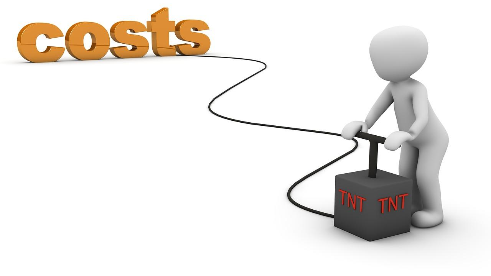

경제학은 선택의 학문이라고도 했다. 경제학에서는 개인뿐 아니라 사회적 차원에서 이루어지는 모든 경제적 선택행위에 대해 연구 한다. 기존의 경제학은 상품 생산, 교환, 소비와 관련된 문제에 대해서 주로 연구하는 학문으로서 받아들여졌지만, 현대의 경제학은 선택의 문제와 관련된 모든 것이 연구 대상이다. 

현대에 들면서 경제학에서 다루는 관심사가 매우 포괄적이고 넓어졌다. 범죄와 처벌의 경제학, 예술의 경제학, 스포츠의 경제학 등 다양한 관심 분야의 경제학이 생기고 있다. 이외에도 국가와 사회라는 큰 차원에서 이루어지는 선택도 각 사회마다, 나라마다 다른 경제제도와, 그 경제제도로 인해 나타나는 독특한 경제현상을 배우고 이해하는 것이다. 즉 경제학의 원론은 모든 분야에서 합리적 선택을 가능하게 한다. 

## 합리적 선택이란

경제학에서 **'모든 주체는 합리적'**이라는 기본적인 가정을 가진다. 그래서 경제학에서 설정하고 있는 경제인(homo economicus)은 합리성을 특징으로 하는 전형적인 인간형을 의미한다. 합리적 선택은 주어진 목표를 가장 효율적으로 달성할 수 있게 해야 한다. 

합리적 선택이 무엇인가를 알기 위해서는 선택이라는 행위에 대해서 좀 더 구체적으로 봐야한다. 
우리는 어떤 방식으로 선택할까? 

많은 사람들이 쉬운 목표에 있어서는 무의식적으로 선택을 하지만, 어려운 목표는 많은 고민 후에 선택을 한다. 쉬운 목표이든, 어려운 목표이든 우리는 선택을 통해 얻는 것이 있고 잃는 것이 있다. 경제학적 용어로는 얻는 것을 **편익(benefit)**, 잃는 것을 **비용(cost)**이라고 한다. 

예를 들어 내일 시험이라고 하자. 게임을 해서 재미를 얻고 싶은 욕구와 시험 공부를 해서 좋은 성적을 얻고 싶은 욕구가 있을 것이다. 내일 시험인데 지금 게임을 재미를 얻지만, 좋은 성적은 잃는다. 득이 있으면 실이 있다. 반대로 말하면 실이 없는 득은 없다는 것이다. 우리는 어떤 것을 얻을 때 무조건 그만한 대가를 지급하게 되고, 이것이 바로 경제학의 원리이다.

## 비용이란
편익을 위해 비용은 어쩔 수 없는 것이지만, 비용을 줄이면서 높은 편익을 얻을 수 있게 하면 된다. 위험을 줄이고 더 높은 성과를 얻으면 된다. 최소의 비용으로 최대의 편익을 거둘 수 있는 선택을 하면 된다. 물론 쉽지 않다. 경제학에서는 인간을 합리적이다라고 가정하지만, 실제로 그렇지 않다. 많은 사람들이 비합리적인 선택을 하고, 그것을 통해 손실을 얻기 때문이다. 

합리적 선택을 위해서는 비용을 정확히 파악하고 있어야 한다. 편익이 아니라 비용을 파악하는 이유는 일반적으로 편익은 개인이나 사회가 컨트롤 할 수 없기 때문이다. 하지만 비용은 주체가 정확히 파악하고 있다면 선택을 통해 최소화할 수 있다. 

경제학에서는 이 비용을 **기회비용**의 개념으로 파악해야 한다. 우리가 흔히 생각하는 비용은 회계비용(accounting cost)이다. 회계비용은 실제로 지출한 비용이다. 하지만 기회비용(Opportunity cost)은 선택에 의해 포기해야 하는 행위 중 가장 큰 가치를 갖는 행위이다. 경제학에서는 아무리 이윤이 1억이라고 해도, 실제로 지출하지 않은 기회비용을 포함한 비용이 1억 5천만원 이라면, 5천만원을 손해본 것이다.

## 매몰비용

이 비용 이외에도 **매몰비용(sunk cost)**이라는 것이 있다. 매몰비용은 어떤 선택을 하던 이미 지출되었기 때문에 다시 회수 할 수 없는 성격의 비용이다. 우리가 선택을 할 때 매몰 비용은 의사결정에 고려하지 않는 것이다. 이 매몰 비용은 흔히 현재까지의 투자라고 생각하면 된다. 

예를 들면 **주식 투자**를 하고 있다고 하자. 수익을 얻고자 주식투자를 했지만, 손실을 보고 있고 하락 추세인 경우이다. 어떤 사람들은 현재 손실이 아까워서 하락추세에도 반등이 올 것이라 믿고 더 기다린다. 또 다른 사람들은 왜 하락하는지 파악한 후 손절하여 큰 손실을 막고, 반등 상황에 들어가 수익을 얻는다. 

전자의 사람은 비합리적 선택을 한 것이다. 지금까지 기다린 시간은 수익을 얻을 것이라 기대하고 선택한 투자이다. 손실을 보고 있는 상황에서, 전자의 사람은 기다린 시간과 손실이 아깝다는 이유만으로 손절을 하지 못했다. 경제학에서는 이 기다린 시간과 손실은 매몰비용이다. 이미 지출된 뒤에 어떤 선택을 하던 다시 회수할 수 없기 때문이다. 

후자의 사람은 합리적 선택을 한 것이다. 손실과 기다린 시간을 고려하지 않고, 현재의 하락추세를 파악한 의사결정을 했기 때문이다.

비합리적 선택을 하는 것은 비단 개인뿐만이 아니다. 매몰비용의 대표적인 예인 **콩고드의 오류(Concorde fallacy)**는 프랑스와 영국이라는 두 국가가 비합리적인 선택으로 인해 손해를 본 예시이다. 프랑스와 영국은 기존 여객기보다 2배 이상 빠른 콩코드 여객기를 개발도중, 높은 생산비와 기체 결함 등의 다양한 이유로 사업 전망이 비관적임을 깨닫고 개발을 지속할지 여부를 고민했다. 

하지만 프랑스와 영국은 이 때까지 들어간 **1조 6천원**의 비용이 아까워서 개발을 지속했고, 1976년 1월 21일 영국 항공이 상용비행을 첫 시작했다. 30여년간 비행했지만 결국 높은 비용와, 기체 결함, 대기 오염 등 예측했던 문제로 인해서 2003년 11월 26일 마지막 비행으로 역사속에 묻혀졌다.

'''toc
'''